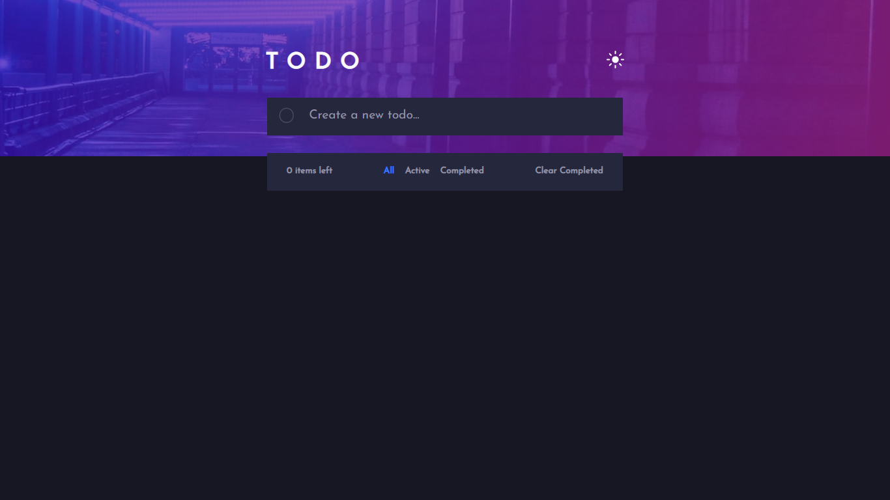
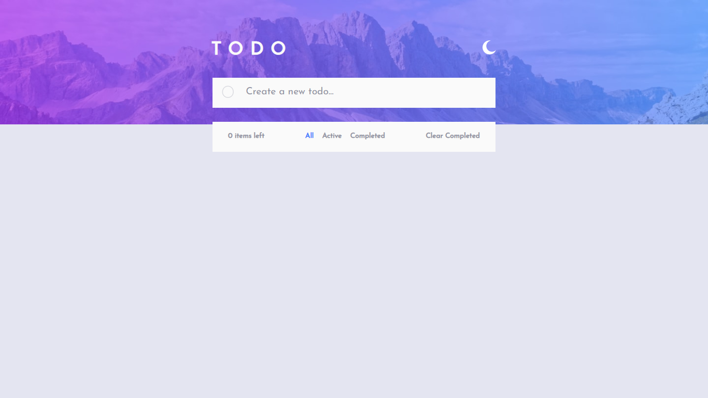
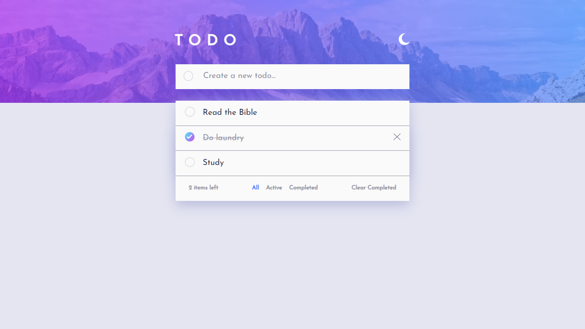
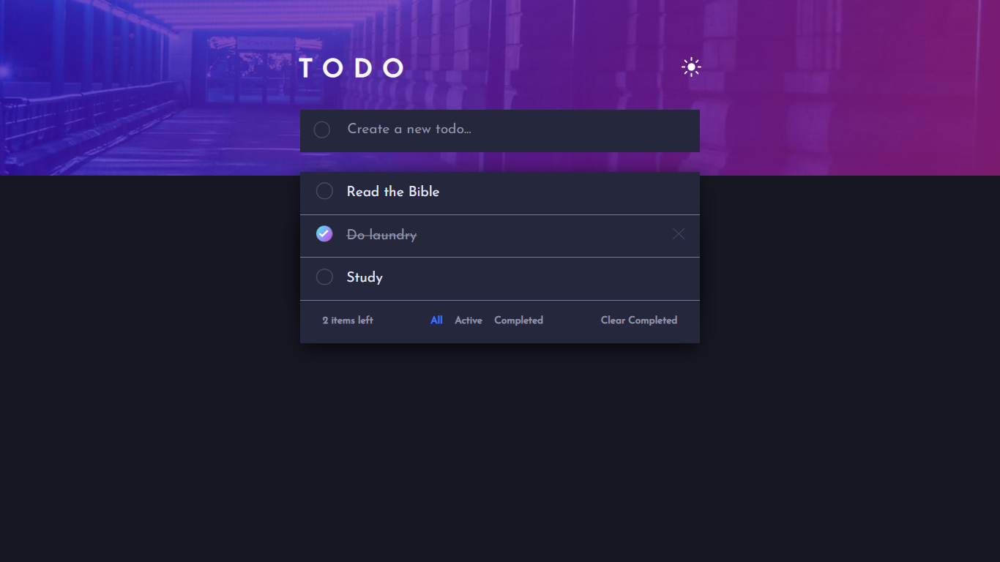

# Frontend Mentor - Todo app solution

## Table of contents

- [Overview](#overview)
  - [The challenge](#the-challenge)
  - [Screenshots](#screenshots)
  - [Links](#links)
- [My process](#my-process)
  - [Built with](#built-with)
  - [What I learned](#what-i-learned)
  - [Continued development](#continued-development)
- [Author](#author)
- [Acknowledgments](#acknowledgments)

## Overview

### The challenge

Users should be able to:

- View the optimal layout for the app depending on their device's screen size
- See hover states for all interactive elements on the page
- Add new todos to the list
- Mark todos as complete
- Delete todos from the list
- Filter by all/active/complete todos
- Clear all completed todos
- Toggle light and dark mode

### Screenshots






### Links

- Live Site URL: [Todo App](https://todo-app-henna-eight.vercel.app/)

## My process

### Built with

- HTML
- CSS
- Javascript
- Google Fonts


### What I learned

- How to change HTML elements based on screen size
- How to chanage an image when clicked
- How to remove trailing whitespace from a string
- How to add left box-shadow

```CSS
.light-tasks {
    box-shadow: 0.001vw 1% 2vw hsl(236, 33%, 80%), -0.001vw 9vh 2vw hsl(236, 33%, 80%);
}
```
```JS
// How to chanage an image when clicked
themeBtn.onclick = () => {
  if (currTheme == "./images/icon-sun.svg") {
    themeBtn.setAttribute('src', "./images/icon-moon.svg")
  } else {
    themeBtn.setAttribute('src', "./images/icon-sun.svg")
  }
}

// How to change HTML elements based on screen size
if (window.innerWidth < 650) {
    const mobileFooter = document.querySelector('.footer')
    mobileFooter.innerHTML = `
    <p>
    <span id="remaining">0 items left</span>
    <span class="clear">Clear Completed</span>
  </p>`;
    mobileFooter.insertAdjacentHTML('afterend', `<div class="mobile-cat">
    <span class="footer-btns">
      <button id="all" class="footer-btn">All</button>
      <button id="active" class="footer-btn">Active</button>
      <button id="completed" class="footer-btn">Completed</button>
    </span>
  </div>`)
 
}
```

### Continued development

- Functional Programming
- Responsive elements

## Author

- Frontend Mentor - [@Oluwadt](https://www.frontendmentor.io/profile/Oluwadt)
- Twitter - [@oluwadt](https://www.twitter.com/oluwadt)

## Acknowledgments

- [Chat GPT](https://chat.openai.com/)
